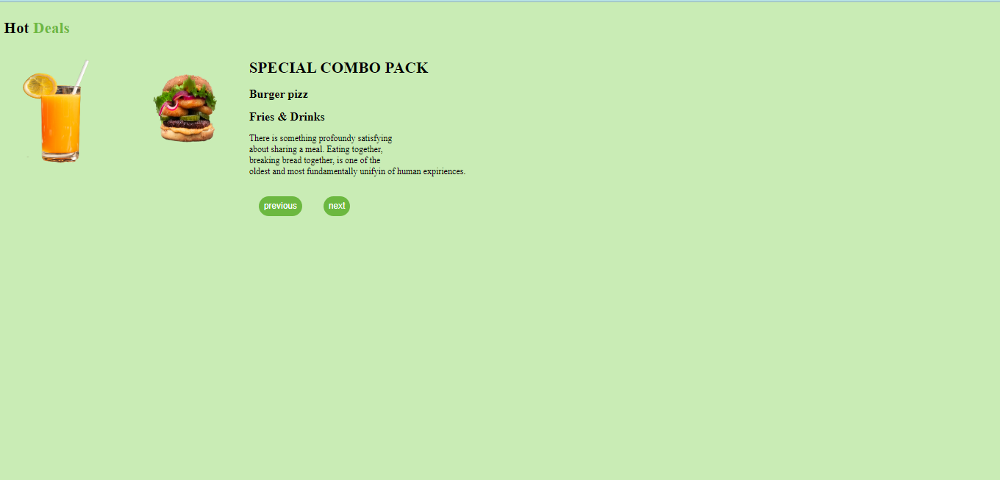
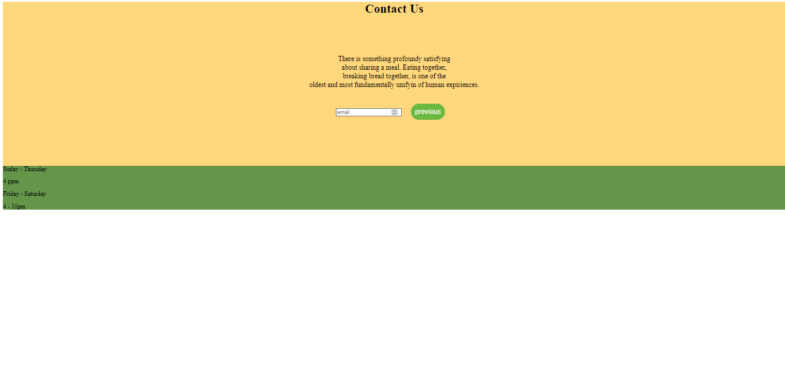

# Street food
This is a simple website that demonstrates street dishes and varios meals.

It contains images which represent such kind of dishes available

You can view live through the link below


## Tools 
This project was created using the following resources:

- HTML5
- CSS
- Markdown

## Prequisites
In order to run the application, you will need the following or not less of:

- Linux / Windows / MaCos
- 2 GB RAM
- 4 GB Free space
- A broswer

## SetUp
This section will guide you on how you can setup and run the website on your machine.

1 Clone the repository to your *local* machine. On your `Terminal` (**Linux / MaCos**) or `Gitbash` / `Wsl` (**Windows**)

```
git clone: https://github.com/morrismutiso/project-03
```

2 Change into the working directory
```
cd project-03.readme
```

3 Open visual studio code
```
code .
```
4 Run on the browser by opening it through live server.

### Screens
| Screen 1                | Screen 2                | Screen 3           | screenshot4 | screenshot5 
|  |  |  |  | 

## Author
[morrismutiso](https://github.com/morrismutiso)

## Known issues
Currently, there are no known issues.

## License
This website has been distributed under the MIT LICENSE

